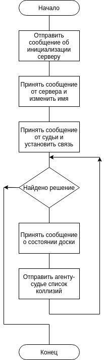

# N FIGURES AGENT

Агент-фигура - последовательная программа,
которая работает по алгоритму представленному блок-схемой.

Суть этого агента заключается в поиске всех фигур, 
которые находятся под боем фигуры, закрепленной
за этим агентом. За счет работы агентов на разных 
процессорах, достигается параллелизм, что особенно
эффективно при большом количестве фигур на доске.

[Подробнее](docs/n_figures.pdf)
